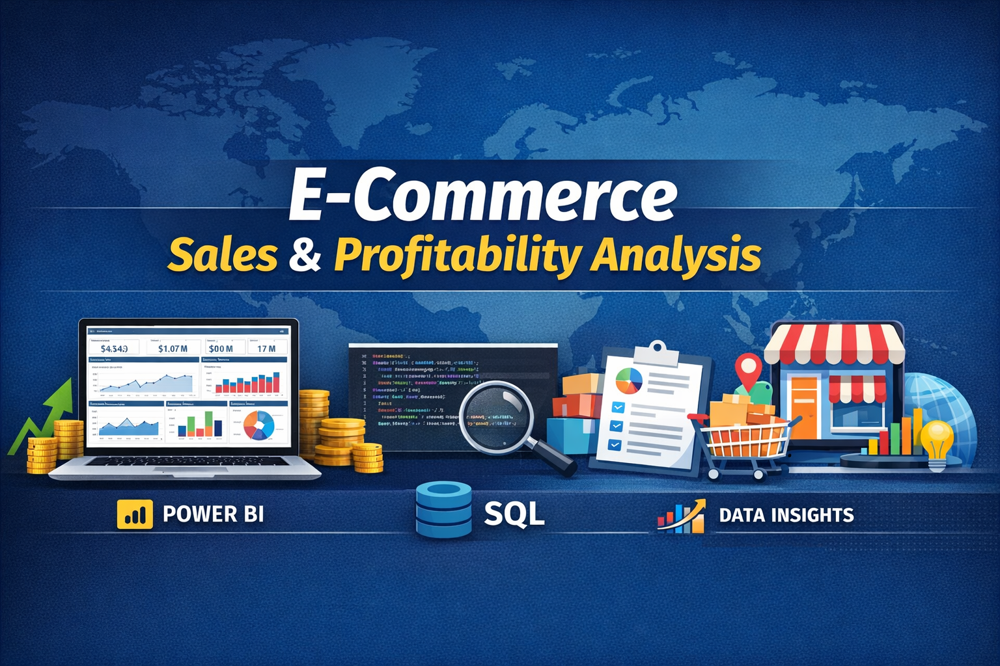

  

# 📊 E-Commerce Sales & Profitability Analysis (Power BI + SQL)

## 🔍 Project Overview
This project analyzes e-commerce sales data to uncover key revenue drivers, profitability trends, customer behavior, and the financial impact of discounting.  
The goal is to enable data-driven decisions around pricing, product portfolio optimization, customer segmentation, and regional strategy.

The analysis was delivered through an interactive **Power BI dashboard** supported by **SQL-based data exploration and validation**.

---

## 🧠 Business Questions Answered
- Which product categories and subcategories drive the highest profit?
- How do discounts impact profitability across products?
- Which customer segments contribute the most revenue?
- Which regions and states are overperforming or underperforming?
- Which products should be promoted, optimized, or discontinued?

---

## 🛠 Tools & Technologies
- **Power BI** – Dashboarding & DAX measures  
- **SQL (MySQL / PostgreSQL compatible)** – Data validation & aggregation  
- **Excel / CSV** – Source dataset  

---

## 📈 Key KPIs
- Total Sales  
- Total Profit  
- Total Orders  
- Total Quantity Sold  
- Profit Margin  

---

## 📊 Dashboard Pages
### 1️⃣ Overall Sales Performance
- Monthly sales trends
- Sales by category and subcategory
- Profit by region

### 2️⃣ Customer & Market Analysis
- Sales and profit by customer segment
- Regional and state-level performance

### 3️⃣ Product Performance & Discount Analysis
- Top 10 best-selling products
- Bottom 10 least-selling products
- Discount vs Profit impact analysis (scatter plot)

---

## 🔑 Key Insights
- Body Care is the most profitable category, contributing ~55% of total profit.
- Home & Accessories shows consistent negative profitability, indicating pricing or discount inefficiencies.
- Corporate customers generate the highest revenue and profit.
- Heavy discounting is strongly correlated with reduced profit margins.
- Several low-selling products present inventory optimization opportunities.

---

## 💡 Business Recommendations
- Optimize discount strategies by limiting heavy discounts on low-margin products.
- Prioritize high-profit, high-demand products in marketing and inventory planning.
- Re-evaluate pricing for loss-making categories.
- Focus regional investments on top-performing states and markets.

---

## 📂 Project Files
- `/Dashboard` – Power BI (.pbix) file  
- `/SQL` – Data validation and analysis queries  
- `/Docs` – Business insights & recommendations  

---

## 👤 Author
**Munawer Jabeen**  
Data Analyst | Power BI | SQL  
🔗 LinkedIn: *(add link)*  
📧 Email: *(optional)*

